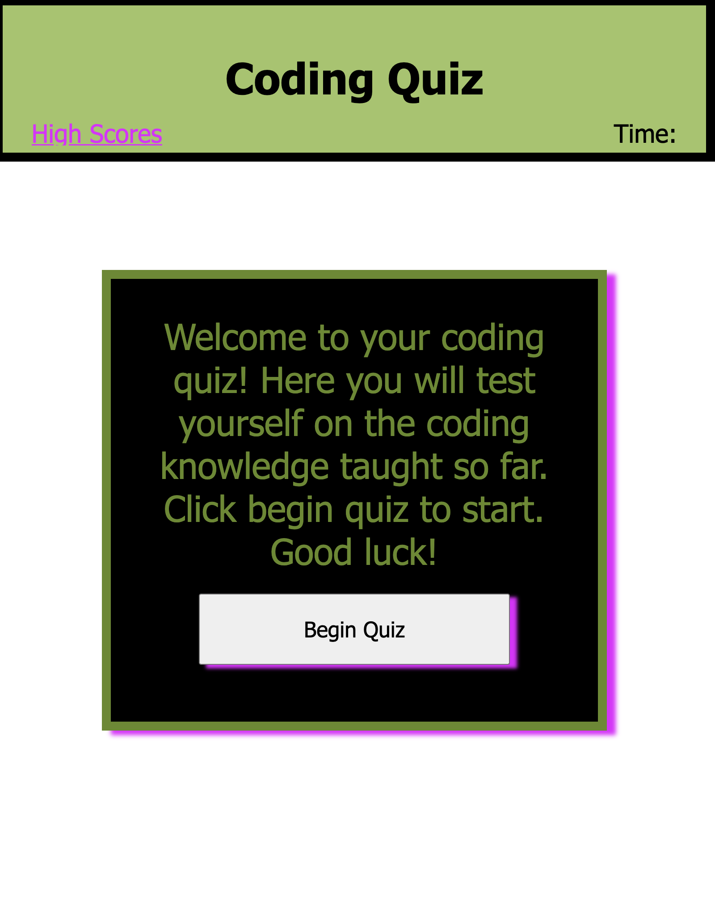
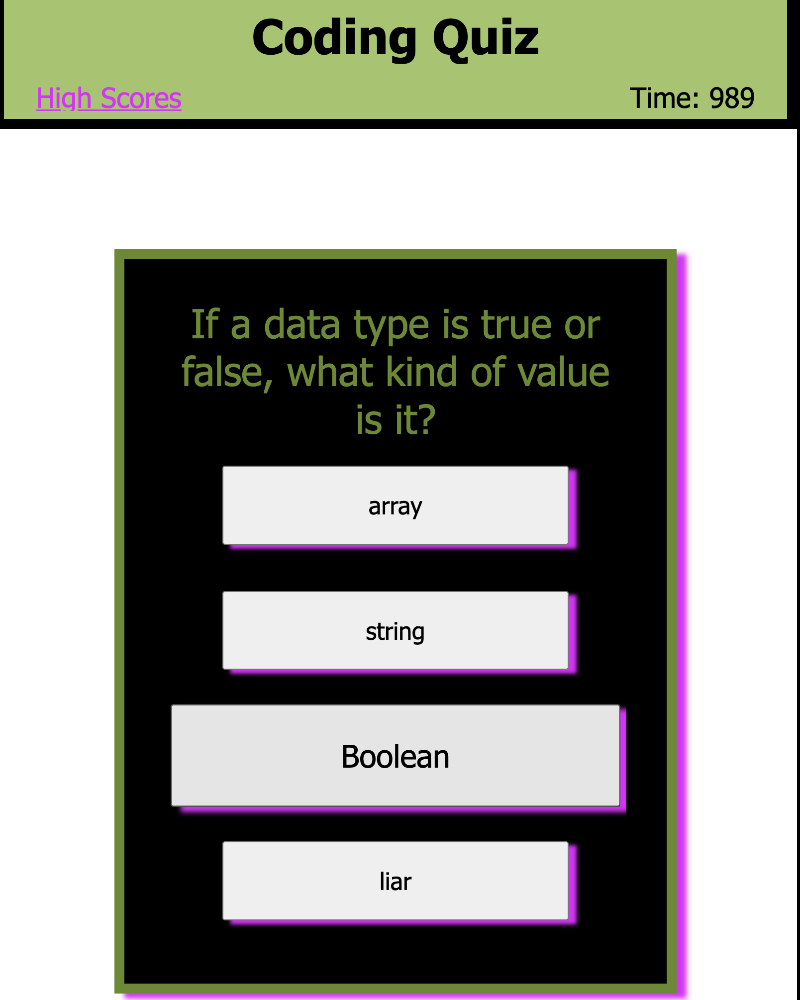
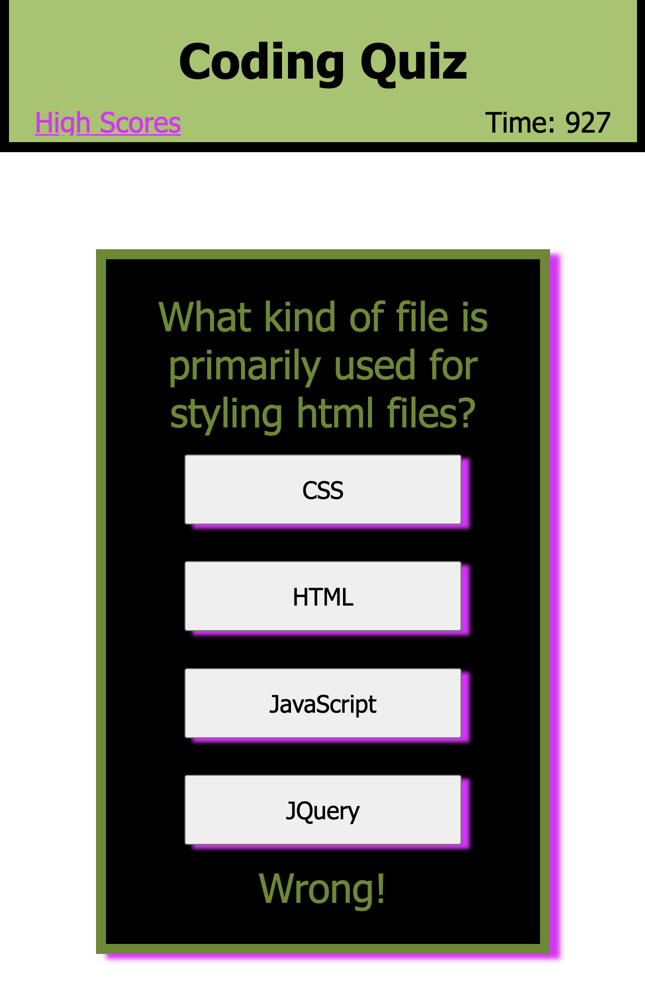
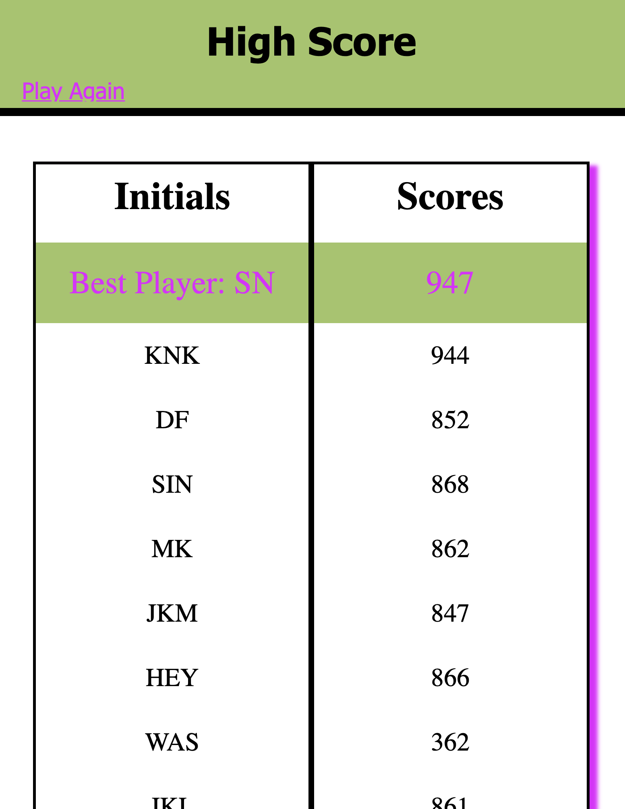

## Coding Quiz Game

## Description
A quiz game with the capability to countdown once triggered by pressing the "Begin Quiz" button, decreasing time when questions are answered incorrectly, and logging the scores once the quiz is completed.

### Screen Previews

### View from a desktop:

## Installation
Extra equipment is not needed to view this project.

## Usage
This site provides a much more organized manner to present a developer's word to those looking to hire them for services or as an employee.

## Roadmap
I would add JavaScript to the site when learned to make it more interactive and possibly log inquiries.

## Project status
In progress.

## Links
Deployed Site: https://shannyan.github.io/two-port/
Repo: https://github.com/ShannyaN/two-port