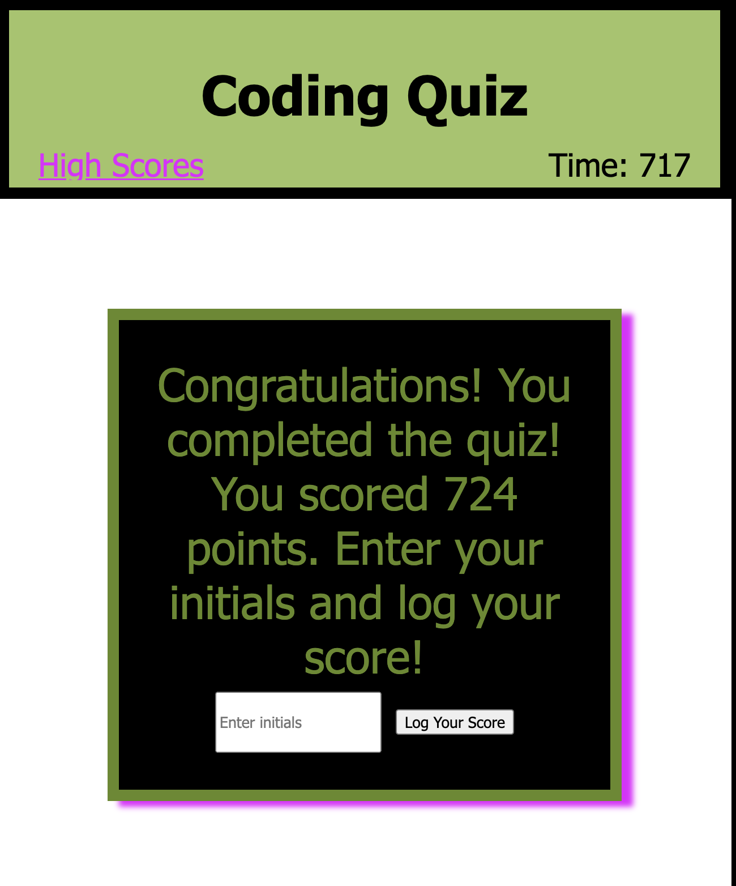

## Coding Quiz Game

## Description
A quiz game with the capability to countdown once triggered by pressing the "Begin Quiz" button, decreasing time when questions are answered incorrectly, and logging the scores once the quiz is completed.

### Screen Previews

## Installation
Extra equipment is not needed to view this project.

## Usage
This site provides a game with automated correcting, timing, and score logging to record progrress.

## Roadmap
I would add more quesions and a shuffle component so the questions could appear at random.

## Project status
Complete.

## Links
Deployed Site: https://shannyan.github.io/four-qzgm/
Repo: https://github.com/ShannyaN/four-qzgm